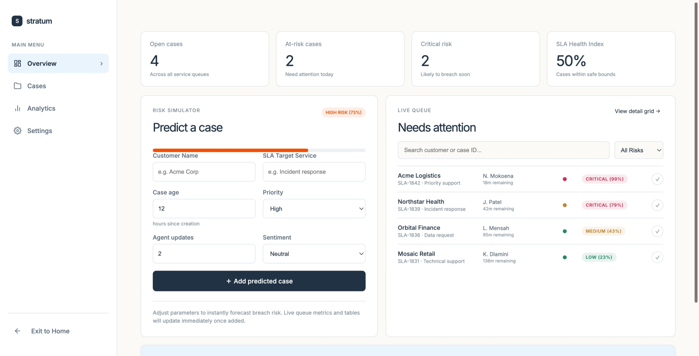

# Stratum

Stratum is a lightweight SLA breach-risk dashboard for support teams. It turns everyday case signals into a clear risk score, helping teams focus on the work most likely to miss its service target.

## Preview



## What it includes

- A live support-case queue, ordered visually by risk level
- At-a-glance counts for open, at-risk, and critical cases
- An interactive risk simulator for testing a case before it enters the queue
- A transparent client-side scoring model based on case age, priority, agent activity, and customer sentiment
- A responsive, minimal Inter-based interface
- **Palantir Blueprint UI System** integration for dark-theme structure, side navigation, form fields, and status badges
- **Palantir Plottable.js Charting** for interactive, responsive queue analytics

## Enterprise Features & Palantir Integration

Stratum features professional integrations with Palantir's open-source developer tooling:

- **Blueprint UI (`@blueprintjs/core` & `@blueprintjs/icons`)**: Sets the foundation for the dark theme (`bp6-dark`) across the entire workspace. It provides the structured left-sidebar layout, form controls, select fields, and status indicators.
- **Plottable.js (`plottable` & `d3`)**: Powers the three custom interactive charts in the **Analytics** tab (SLA Breach Trend line plot, Case Distribution bar chart, and Agent Performance horizontal bar chart). It is configured to automatically redraw layout scales when the window dimensions resize.

## Risk model

The current prototype calculates a breach likelihood from four simple signals:

| Signal             | Why it matters                                       |
| ------------------ | ---------------------------------------------------- |
| Case age           | Older cases have less time to meet their SLA target. |
| Priority           | Urgent or critical issues carry more breach risk.    |
| Agent updates      | Fewer updates indicate an unattended case.           |
| Customer sentiment | Negative sentiment increases the risk signal.        |

The score is displayed as one of four levels: **Low**, **Medium**, **High**, or **Critical**. The model runs entirely in the browser; it does not send or store case data.

## Run locally

### Prerequisites

- Node.js 20 or newer
- npm

### Install and start

```bash
git clone https://github.com/luthandombanjwa/stratum.git
cd stratum
npm install
npm run dev
```

Open the local URL shown by Vite—normally `http://localhost:5176`.

## Production build

```bash
npm run build
```

The optimized site is written to `dist/`.

## Project structure

```text
src/
  main.jsx            App UI, example cases, and the risk model
  StratumCharts.jsx   Plottable and D3 interactive chart components
  styles.css          Responsive visual system and component styles
DESIGN.md             Design-system reference
```

## Current scope

This is a front-end prototype with sample cases. The next natural step is connecting it to a real support platform or API, replacing sample data with live cases, and moving the scoring model to a backend service.
